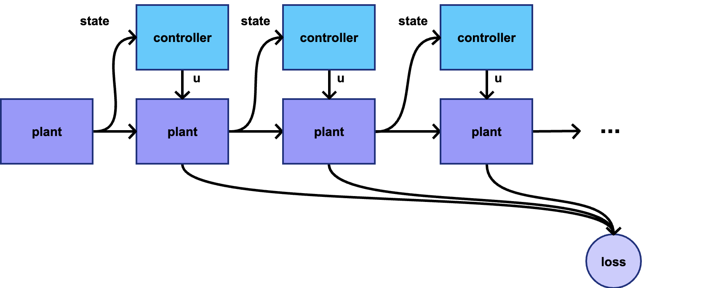
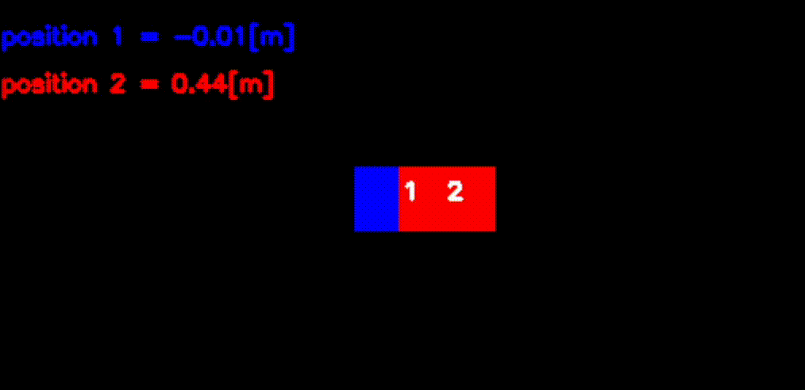
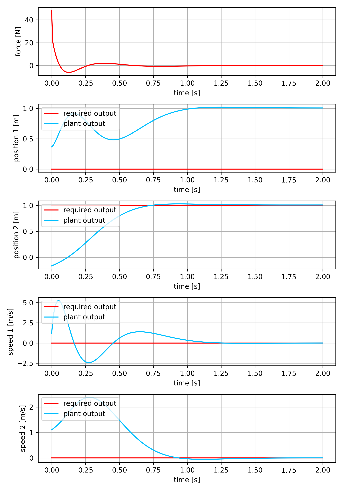

# pytorch dynamical systems controll library

- trajectory is computed by forward pass
- backward pass truth graph learns controller
- works for linear and nonlinear systems / controller




## install

```bash
pip3 install -e .
```

requirements : numpy, pytorch, matplotlib
opencv for visualisation


## two carts controll example




```python
import torch
import LibsControll 

dt = 1.0/200.0

'''
create example dynamical system, 4th order
state is : pos1, pos2, vel1, vel2
'''
plant       = LibsControll.TwoCarts() 

print(str(plant))

'''
train controller, 400 steps trajectory length
care only for pos2, loss_weight=[0, 1, 0, 0]
'''
controller   = LibsControll.fit_controller(LibsControll.LQC, plant, steps = 400, amplitudes=[0, 1, 0, 0], loss_weight=[0, 1, 0, 0])

'''
plot result for step response
'''
t_trajectory, y_req_trajectory, u_trajectory, y_trajectory  = LibsControll.step_response(controller, plant, amplitudes=[0, 1, 0, 0], dt=dt)
LibsControll.plot_controll_output(t_trajectory, u_trajectory, y_req_trajectory, y_trajectory, ["force [N]"], ["position 1 [m]", "position 2 [m]", "speed 1 [m/s]", "speed 2 [m/s]"], "images/carts_step_response.png")

print(str(controller))
```

### to simulate trained controller run : 

```python
...

clr = LibsControll.ClosedLoopResponseContinuous(plant, controller, dt)

y_req       = torch.zeros((1, plant.mat_a.shape[0]))
y_req[:, :] = 1.0

x     = torch.zeros((1, plant.mat_a.shape[0]))

steps = 0

while True:
    y, x = clr.step(y_req, x)

    plant.render()

    steps+= 1
    if steps%400 == 0:
        y_req*= -1
```


### step response


### controller matrix

```
controll_mat=
 -0.0000 
  1.3169 
  0.0000 
  0.0000 
 -0.4724 
 -0.8544 
 -0.1259 
 -0.2667
```
